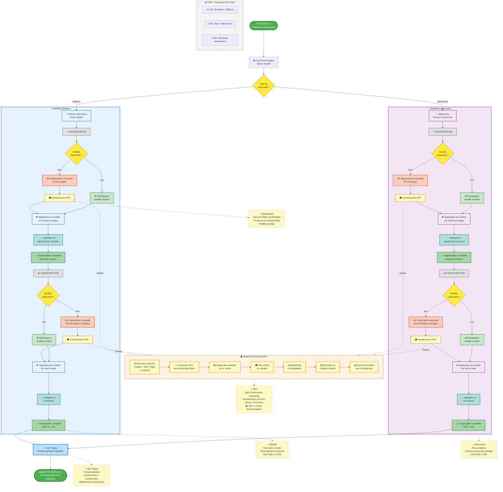

# Module4

> **Note**: Ce diagramme est également disponible en format image PNG dans le même dossier.

```mermaid
flowchart TD
    %% ========================================
    %% MODULE 4 - TRAITEMENT ESCRIPTORIUM
    %% ========================================

    START([⚙️ MODULE 4<br/>Traitement eScriptorium])

    IMPORT[📥 Import des images<br/>depuis Seafile]

    START --> IMPORT

    %% ========================================
    %% DÉCISION TYPE DE DOCUMENT
    %% ========================================
    DECISION{Type de<br/>document ?}

    IMPORT --> DECISION

    %% ========================================
    %% BRANCHE ÉDITIONS
    %% ========================================
    subgraph EDITIONS_FLOW [📖 Workflow Éditions]
        ED_START[📖 Éditions imprimées<br/>Texte régulier]

        %% Segmentation
        ED_SEG_TITLE[🔲 SEGMENTATION]
        ED_SEG_CHOICE{Modèle<br/>disponible ?}
        ED_SEG_MANUEL[✍️ Segmentation manuelle<br/>50-100 pages]
        ED_SEG_REUSE[♻️ Réutilisation<br/>modèle existant]
        ED_SEG_TRAIN[🎓 Entraînement HPC]
        ED_SEG_APPLY[▶️ Application du modèle<br/>sur toutes les pages]
        ED_SEG_VALID[✅ Validation et<br/>ajustements manuels]
        ED_SEG_RESULT[✅ Segmentation complète<br/>Données propres]

        %% Transcription
        ED_TRANS_TITLE[✍️ TRANSCRIPTION]
        ED_TRANS_CHOICE{Modèle<br/>disponible ?}
        ED_TRANS_MANUEL[✍️ Transcription manuelle<br/>100-200 lignes corrigées]
        ED_TRANS_REUSE[♻️ Réutilisation<br/>modèle existant]
        ED_TRANS_TRAIN[🎓 Entraînement HPC]
        ED_TRANS_APPLY[▶️ Application du modèle<br/>sur tout le texte]
        ED_TRANS_VALID[✅ Validation et<br/>corrections]
        ED_TRANS_RESULT[✅ Transcription complète<br/>CER: 0.1-2%]

        ED_START --> ED_SEG_TITLE
        ED_SEG_TITLE --> ED_SEG_CHOICE
        ED_SEG_CHOICE -->|Non| ED_SEG_MANUEL
        ED_SEG_CHOICE -->|Oui| ED_SEG_REUSE
        ED_SEG_MANUEL --> ED_SEG_TRAIN
        ED_SEG_TRAIN --> ED_SEG_APPLY
        ED_SEG_REUSE --> ED_SEG_APPLY
        ED_SEG_APPLY --> ED_SEG_VALID
        ED_SEG_VALID --> ED_SEG_RESULT

        ED_SEG_RESULT --> ED_TRANS_TITLE
        ED_TRANS_TITLE --> ED_TRANS_CHOICE
        ED_TRANS_CHOICE -->|Non| ED_TRANS_MANUEL
        ED_TRANS_CHOICE -->|Oui| ED_TRANS_REUSE
        ED_TRANS_MANUEL --> ED_TRANS_TRAIN
        ED_TRANS_TRAIN --> ED_TRANS_APPLY
        ED_TRANS_REUSE --> ED_TRANS_APPLY
        ED_TRANS_APPLY --> ED_TRANS_VALID
        ED_TRANS_VALID --> ED_TRANS_RESULT
    end

    %% ========================================
    %% BRANCHE MANUSCRITS
    %% ========================================
    subgraph MANUSCRITS_FLOW [📜 Workflow Manuscrits]
        MS_START[📜 Manuscrits<br/>Écriture manuscrite]

        %% Segmentation
        MS_SEG_TITLE[🔲 SEGMENTATION]
        MS_SEG_CHOICE{Modèle<br/>disponible ?}
        MS_SEG_MANUEL[✍️ Segmentation manuelle<br/>50-100 pages]
        MS_SEG_REUSE[♻️ Réutilisation<br/>modèle existant]
        MS_SEG_TRAIN[🎓 Entraînement HPC]
        MS_SEG_APPLY[▶️ Application du modèle<br/>sur toutes les pages]
        MS_SEG_VALID[✅ Validation et<br/>ajustements manuels]
        MS_SEG_RESULT[✅ Segmentation complète<br/>Données propres]

        %% Transcription
        MS_TRANS_TITLE[✍️ TRANSCRIPTION]
        MS_TRANS_CHOICE{Modèle<br/>disponible ?}
        MS_TRANS_MANUEL[✍️ Transcription manuelle<br/>100-200 lignes corrigées]
        MS_TRANS_REUSE[♻️ Réutilisation<br/>modèle existant]
        MS_TRANS_TRAIN[🎓 Entraînement HPC]
        MS_TRANS_APPLY[▶️ Application du modèle<br/>sur tout le texte]
        MS_TRANS_VALID[✅ Validation et<br/>corrections]
        MS_TRANS_RESULT[⚠️ Transcription complète<br/>CER: 4-8%]

        MS_START --> MS_SEG_TITLE
        MS_SEG_TITLE --> MS_SEG_CHOICE
        MS_SEG_CHOICE -->|Non| MS_SEG_MANUEL
        MS_SEG_CHOICE -->|Oui| MS_SEG_REUSE
        MS_SEG_MANUEL --> MS_SEG_TRAIN
        MS_SEG_TRAIN --> MS_SEG_APPLY
        MS_SEG_REUSE --> MS_SEG_APPLY
        MS_SEG_APPLY --> MS_SEG_VALID
        MS_SEG_VALID --> MS_SEG_RESULT

        MS_SEG_RESULT --> MS_TRANS_TITLE
        MS_TRANS_TITLE --> MS_TRANS_CHOICE
        MS_TRANS_CHOICE -->|Non| MS_TRANS_MANUEL
        MS_TRANS_CHOICE -->|Oui| MS_TRANS_REUSE
        MS_TRANS_MANUEL --> MS_TRANS_TRAIN
        MS_TRANS_TRAIN --> MS_TRANS_APPLY
        MS_TRANS_REUSE --> MS_TRANS_APPLY
        MS_TRANS_APPLY --> MS_TRANS_VALID
        MS_TRANS_VALID --> MS_TRANS_RESULT
    end

    %% ========================================
    %% DÉTAIL ENTRAÎNEMENT HPC
    %% ========================================
    subgraph HPC_DETAIL [🖥️ Détail Entraînement HPC]
        HPC_INPUT[📦 Données d'entrée:<br/>Images + XML Pages<br/>+ Script.sh]
        HPC_CONNECT[🔗 Connexion HPC<br/>via commandes Bash]
        HPC_UPLOAD[📤 Upload des données<br/>sur le cluster]
        HPC_FINETUNE[🎓 Fine-tuning<br/>du modèle]
        HPC_MONITOR[📊 Monitoring<br/>et compilation]
        HPC_SELECT[🏆 Sélection du<br/>meilleur modèle]
        HPC_EXPORT[📥 Export du modèle<br/>vers eScriptorium]

        HPC_INPUT --> HPC_CONNECT
        HPC_CONNECT --> HPC_UPLOAD
        HPC_UPLOAD --> HPC_FINETUNE
        HPC_FINETUNE --> HPC_MONITOR
        HPC_MONITOR --> HPC_SELECT
        HPC_SELECT --> HPC_EXPORT
    end

    %% ========================================
    %% CONNEXIONS PRINCIPALES
    %% ========================================
    DECISION -->|Éditions| ED_START
    DECISION -->|Manuscrits| MS_START

    ED_SEG_TRAIN -.->|Détails| HPC_DETAIL
    ED_TRANS_TRAIN -.->|Détails| HPC_DETAIL
    MS_SEG_TRAIN -.->|Détails| HPC_DETAIL
    MS_TRANS_TRAIN -.->|Détails| HPC_DETAIL

    %% ========================================
    %% SORTIE
    %% ========================================
    CONVERGENCE[📄 XML Pages<br/>Format standard PageXML]

    ED_TRANS_RESULT --> CONVERGENCE
    MS_TRANS_RESULT --> CONVERGENCE

    OUTPUT([📤 SORTIE MODULE 4<br/>Vers Nettoyage Post-traitement])

    CONVERGENCE --> OUTPUT

    %% ========================================
    %% ANNOTATIONS
    %% ========================================
    note1[💡 Éditions:<br/>Plus facile à traiter<br/>Texte régulier et imprimé<br/>CER cible: 0.1-2%]
    note2[💡 Manuscrits:<br/>Plus complexe<br/>Écriture manuscrite variable<br/>CER cible: 4-8%]
    note3[💡 HPC:<br/>High Performance Computing<br/>Entraînement sur GPU<br/>Durée: 2-8 heures<br/>📚 Tuto + scripts: Documentation/]
    note4[💡 Réutilisation:<br/>Gain de temps considérable<br/>Si manuscrit similaire traité<br/>Modèle partagé]
    note5[💡 XML Pages:<br/>Format standard<br/>Contient texte + coordonnées<br/>Métadonnées préservées]

    ED_TRANS_RESULT -.-> note1
    MS_TRANS_RESULT -.-> note2
    HPC_DETAIL -.-> note3
    ED_SEG_REUSE -.-> note4
    CONVERGENCE -.-> note5

    %% ========================================
    %% LÉGENDE CER
    %% ========================================
    subgraph CER_LEGEND [📊 CER - Character Error Rate]
        CER1[0.1-2%: Excellent - Éditions]
        CER2[4-8%: Bon - Manuscrits]
        CER3[>10%: Nécessite retraitement]
    end

    %% ========================================
    %% STYLES
    %% ========================================
    classDef startEnd fill:#4caf50,stroke:#2e7d32,stroke-width:3px,color:#fff
    classDef decision fill:#ffeb3b,stroke:#f57f17,stroke-width:2px
    classDef edition fill:#e3f2fd,stroke:#1565c0,stroke-width:2px
    classDef manuscrit fill:#f3e5f5,stroke:#8e24aa,stroke-width:2px
    classDef manuel fill:#ffccbc,stroke:#d84315,stroke-width:2px
    classDef reuse fill:#c8e6c9,stroke:#388e3c,stroke-width:2px
    classDef hpc fill:#fff9c4,stroke:#f57f17,stroke-width:2px
    classDef validation fill:#b2dfdb,stroke:#00796b,stroke-width:2px
    classDef result fill:#a5d6a7,stroke:#2e7d32,stroke-width:2px
    classDef convergence fill:#bbdefb,stroke:#1976d2,stroke-width:3px
    classDef note fill:#fff9c4,stroke:#f57f17,stroke-width:1px,stroke-dasharray: 5 5
    classDef title fill:#e0e0e0,stroke:#757575,stroke-width:2px

    class START,OUTPUT startEnd
    class DECISION,ED_SEG_CHOICE,ED_TRANS_CHOICE,MS_SEG_CHOICE,MS_TRANS_CHOICE decision
    class ED_START,ED_SEG_APPLY,ED_TRANS_APPLY edition
    class MS_START,MS_SEG_APPLY,MS_TRANS_APPLY manuscrit
    class ED_SEG_MANUEL,ED_TRANS_MANUEL,MS_SEG_MANUEL,MS_TRANS_MANUEL manuel
    class ED_SEG_REUSE,ED_TRANS_REUSE,MS_SEG_REUSE,MS_TRANS_REUSE reuse
    class ED_SEG_TRAIN,ED_TRANS_TRAIN,MS_SEG_TRAIN,MS_TRANS_TRAIN,HPC_INPUT,HPC_CONNECT,HPC_UPLOAD,HPC_FINETUNE,HPC_MONITOR,HPC_SELECT,HPC_EXPORT hpc
    class ED_SEG_VALID,ED_TRANS_VALID,MS_SEG_VALID,MS_TRANS_VALID validation
    class ED_SEG_RESULT,ED_TRANS_RESULT,MS_SEG_RESULT,MS_TRANS_RESULT result
    class CONVERGENCE convergence
    class note1,note2,note3,note4,note5 note
    class ED_SEG_TITLE,ED_TRANS_TITLE,MS_SEG_TITLE,MS_TRANS_TITLE title

    style EDITIONS_FLOW fill:#e3f2fd,stroke:#1565c0,stroke-width:2px
    style MANUSCRITS_FLOW fill:#f3e5f5,stroke:#6a1b9a,stroke-width:2px
    style HPC_DETAIL fill:#fff3e0,stroke:#e65100,stroke-width:2px,stroke-dasharray: 5 5
    style CER_LEGEND fill:#f5f5f5,stroke:#616161,stroke-width:2px,stroke-dasharray: 3 3

```

---
*Généré automatiquement depuis `flowchart-module4.mmd`*
