# Module 8 - Diffusion Nakala

> **Note**: Ce diagramme montre le workflow complet avec les scripts du dossier `/Nakala/`

```mermaid
flowchart TD
    %% ========================================
    %% MODULE 8 - DIFFUSION DES DONNÉES NAKALA
    %% ========================================

    START([📤 MODULE 8<br/>Diffusion Nakala])

    %% ========================================
    %% ENTRÉES
    %% ========================================
    subgraph INPUTS [📥 ENTRÉES depuis MODULE 6]
        I1[📄 Fiches .docx<br/>Edi-XX + Libre de droits]
        I2[📝 Verticaux .txt<br/>Corpus annotés]
        I3[📁 Textes/<br/>pages_index.json + pages]
    end

    START --> INPUTS

    %% ========================================
    %% ÉTAPE 1 : VALIDATION
    %% ========================================
    subgraph STEP1 [🔍 ÉTAPE 1 : Validation]
        V1[🐍 validate_export.py]
        V2[Vérifie cohérence<br/>Fiche ↔ Vertical ↔ Textes]
        V3[📋 Rapport de validation<br/>Complets / Exportables / Manquants]

        V1 --> V2 --> V3
    end

    INPUTS --> STEP1

    %% ========================================
    %% ÉTAPE 2 : PRÉPARATION
    %% ========================================
    subgraph STEP2 [📦 ÉTAPE 2 : Préparation Structure]
        P1[🐍 prepare_nakala_export.py]
        P2[Association par Edi-XX]
        P3[Conversion .docx → .pdf<br/>via LibreOffice]
        P4[Création structure<br/>Libre / Non_libre]

        P1 --> P2 --> P3 --> P4
    end

    STEP1 --> STEP2

    %% ========================================
    %% DÉCISION DROITS
    %% ========================================
    DECISION{Libre de<br/>droits ?}

    STEP2 --> DECISION

    %% ========================================
    %% BRANCHE LIBRE - NAKALA
    %% ========================================
    subgraph NAKALA_FLOW [✅ Libre de droits → Nakala]
        N1[📁 Libre_de_droits/<br/>Oeuvre_Edi-XX/]
        N2[🐍 upload_nakala.py<br/>via Heimdall]
        N3[☁️ Upload API Nakala]
        N4[🔗 Attribution DOI]
        N5[📄 Génère cisame.xml]

        N1 --> N2 --> N3 --> N4 --> N5
    end

    DECISION -->|Oui| N1

    %% ========================================
    %% BRANCHE RESTREINTE - SEAFILE
    %% ========================================
    subgraph SEAFILE_FLOW [🔒 Droits restreints → Seafile]
        S1[📁 Non_libre_de_droits/<br/>Oeuvre_Edi-XX/]
        S2[📤 Copie manuelle<br/>vers Seafile]
        S3[☁️ Stockage privé<br/>Accès restreint]

        S1 --> S2 --> S3
    end

    DECISION -->|Non| S1

    %% ========================================
    %% ÉTAPE 4 : ENRICHISSEMENT
    %% ========================================
    subgraph STEP4 [🔗 ÉTAPE 4 : Enrichissement URLs]
        E1[🐍 add_nakala_links.py]
        E2[Parse cisame.xml]
        E3[Récupère hash SHA1<br/>via API Nakala]
        E4[Ajoute link= et fiche=<br/>dans verticaux]

        E1 --> E2 --> E3 --> E4
    end

    N5 --> STEP4

    %% ========================================
    %% SORTIES
    %% ========================================
    subgraph OUTPUTS [📤 SORTIES]
        O1[☁️ Nakala<br/>Corpus publics + DOI]
        O2[☁️ Seafile<br/>Corpus privés]
        O3[📝 Verticaux enrichis<br/>→ MODULE 7 NoSketch]
    end

    STEP4 --> O1
    STEP4 --> O3
    S3 --> O2

    OUTPUT([📤 FIN MODULE 8<br/>Données diffusées])

    O1 --> OUTPUT
    O2 --> OUTPUT
    O3 --> OUTPUT

    %% ========================================
    %% SCRIPTS UTILITAIRES
    %% ========================================
    subgraph UTILS [🛠️ Scripts Utilitaires]
        U1[convert_fiches_to_pdf.py<br/>Conversion PDF séparée]
        U2[clean_dates.py<br/>Nettoie dates vides]
        U3[flatten_textes.py<br/>Aplatit sous-dossiers]
        U4[match_fiches_editions.py<br/>Matching si pas Edi-XX]
    end

    %% ========================================
    %% ANNOTATIONS
    %% ========================================
    note1[💡 pages_index.json<br/>Métadonnées lues<br/>par Heimdall]
    note2[💡 Heimdall<br/>Bibliothèque Python<br/>pour API Nakala]
    note3[💡 DOI<br/>Identifiant pérenne<br/>pour citation]
    note4[💡 link= fiche=<br/>Utilisés par<br/>NoSketch-Engine]

    I3 -.-> note1
    N2 -.-> note2
    N4 -.-> note3
    E4 -.-> note4

    %% ========================================
    %% STYLES
    %% ========================================
    classDef startEnd fill:#4caf50,stroke:#2e7d32,stroke-width:3px,color:#fff
    classDef input fill:#e3f2fd,stroke:#1565c0,stroke-width:2px
    classDef script fill:#fff3e0,stroke:#e65100,stroke-width:2px
    classDef decision fill:#ffeb3b,stroke:#f57f17,stroke-width:3px
    classDef nakala fill:#c8e6c9,stroke:#388e3c,stroke-width:2px
    classDef seafile fill:#ffcdd2,stroke:#c62828,stroke-width:2px
    classDef output fill:#bbdefb,stroke:#1976d2,stroke-width:2px
    classDef note fill:#fff9c4,stroke:#f57f17,stroke-width:1px,stroke-dasharray: 5 5
    classDef utils fill:#f5f5f5,stroke:#616161,stroke-width:1px,stroke-dasharray: 3 3

    class START,OUTPUT startEnd
    class I1,I2,I3 input
    class V1,P1,N2,E1 script
    class DECISION decision
    class N1,N3,N4,N5,O1 nakala
    class S1,S2,S3,O2 seafile
    class O3 output
    class note1,note2,note3,note4 note
    class U1,U2,U3,U4 utils

    style INPUTS fill:#e3f2fd,stroke:#1565c0,stroke-width:2px
    style STEP1 fill:#fff8e1,stroke:#f57f17,stroke-width:2px
    style STEP2 fill:#fff3e0,stroke:#e65100,stroke-width:2px
    style NAKALA_FLOW fill:#e8f5e9,stroke:#2e7d32,stroke-width:2px
    style SEAFILE_FLOW fill:#ffebee,stroke:#c62828,stroke-width:2px
    style STEP4 fill:#e1f5fe,stroke:#0288d1,stroke-width:2px
    style OUTPUTS fill:#e8eaf6,stroke:#3f51b5,stroke-width:2px
    style UTILS fill:#fafafa,stroke:#9e9e9e,stroke-width:1px,stroke-dasharray: 3 3

```

---

## 📊 Explication du graphique

### Flux principal

1. **ENTRÉES** : Le module reçoit 3 types de données depuis MODULE 6 (PAGEtopage) :
   - Fiches .docx contenant les métadonnées et l'identifiant Edi-XX
   - Fichiers verticaux annotés (lemmes, POS)
   - Dossiers textes avec pages_index.json

2. **ÉTAPE 1 - Validation** : Le script `validate_export.py` vérifie la cohérence :
   - Chaque Edi-XX a-t-il ses 3 sources ?
   - Les pages_index.json sont-ils valides ?
   - Les champs obligatoires sont-ils présents ?

3. **ÉTAPE 2 - Préparation** : Le script `prepare_nakala_export.py` :
   - Associe les données par Edi-XX
   - Convertit les fiches .docx → .pdf
   - Crée la structure Libre_de_droits / Non_libre_de_droits

4. **DÉCISION** : Séparation selon le statut des droits (lu depuis les fiches)

5. **BRANCHE NAKALA** (libre de droits) :
   - Upload via Heimdall
   - Attribution de DOI
   - Génération de cisame.xml

6. **BRANCHE SEAFILE** (droits restreints) :
   - Copie manuelle vers le cloud privé
   - Accès restreint à l'équipe

7. **ÉTAPE 4 - Enrichissement** : Le script `add_nakala_links.py` :
   - Parse cisame.xml pour récupérer les DOI
   - Interroge l'API Nakala pour les hash
   - Ajoute les attributs `link=` et `fiche=` dans les verticaux

8. **SORTIES** :
   - Corpus publics sur Nakala avec DOI
   - Corpus privés sur Seafile
   - Verticaux enrichis pour MODULE 7 (NoSketch-Engine)

### Scripts utilitaires

Les scripts en pointillés sont utilisés ponctuellement :
- `convert_fiches_to_pdf.py` : Si conversion séparée nécessaire
- `clean_dates.py` : Si l'API refuse les dates vides
- `flatten_textes.py` : Si la structure des dossiers est incorrecte
- `match_fiches_editions.py` : Si les fiches n'ont pas encore d'Edi-XX

### Annotations

Les notes en jaune expliquent les concepts clés :
- **pages_index.json** : Fichier lu par Heimdall pour les métadonnées
- **Heimdall** : Bibliothèque Python pour interagir avec l'API Nakala
- **DOI** : Identifiant pérenne pour citation académique
- **link= fiche=** : Attributs utilisés par NoSketch-Engine pour afficher les liens

---

*Généré pour le projet CiSaMe - Janvier 2025*
