# Module 8 - Diffusion Nakala

> **Note**: Ce diagramme montre le workflow complet avec les scripts du dossier `/Nakala/`

```mermaid
flowchart TD
    %% ========================================
    %% MODULE 8 - DIFFUSION DES DONNÉES NAKALA
    %% ========================================

    START([MODULE 8 - Diffusion Nakala])

    %% ========================================
    %% ENTRÉES
    %% ========================================
    subgraph INPUTS [ENTREES depuis MODULE 6]
        I1[Fiches .docx<br/>Edi-XX + Libre de droits]
        I2[Verticaux .txt<br/>Corpus annotes]
        I3[Textes/<br/>pages_index.json + pages]
    end

    START --> INPUTS

    %% ========================================
    %% ÉTAPE 1 : VALIDATION
    %% ========================================
    subgraph STEP1 [ETAPE 1 : Validation]
        V1[validate_export.py]
        V2[Verifie coherence<br/>Fiche - Vertical - Textes]
        V3[Rapport de validation<br/>Complets / Exportables / Manquants]

        V1 --> V2 --> V3
    end

    INPUTS --> STEP1

    %% ========================================
    %% ÉTAPE 2 : PRÉPARATION
    %% ========================================
    subgraph STEP2 [ETAPE 2 : Preparation Structure]
        P1[prepare_nakala_export.py]
        P2[Association par Edi-XX<br/>via nakala_utils.py]
        P3[Conversion .docx vers .pdf<br/>via LibreOffice]
        P4[Creation structure<br/>Libre / Non_libre]

        P1 --> P2 --> P3 --> P4
    end

    STEP1 --> STEP2

    %% ========================================
    %% DÉCISION DROITS
    %% ========================================
    DECISION{Libre de<br/>droits ?}

    STEP2 --> DECISION

    %% ========================================
    %% BRANCHE LIBRE - NAKALA
    %% ========================================
    subgraph NAKALA_FLOW [Libre de droits - Nakala]
        N1[Libre_de_droits/<br/>Oeuvre_Edi-XX/]
        N2[upload_nakala.py<br/>via Heimdall<br/>- script externe -<br/>repo nakala-uploader]
        N3[Upload API Nakala]
        N4[Attribution DOI]
        N5[Genere cisame.xml]

        N1 --> N2 --> N3 --> N4 --> N5
    end

    DECISION -->|Oui| N1

    %% ========================================
    %% BRANCHE RESTREINTE - SEAFILE
    %% ========================================
    subgraph SEAFILE_FLOW [Droits restreints - Seafile]
        S1[Non_libre_de_droits/<br/>Oeuvre_Edi-XX/]
        S2[Copie manuelle<br/>vers Seafile]
        S3[Stockage prive<br/>Acces restreint]

        S1 --> S2 --> S3
    end

    DECISION -->|Non| S1

    %% ========================================
    %% ÉTAPE 4 : ENRICHISSEMENT
    %% ========================================
    subgraph STEP4 [ETAPE 4 : Enrichissement URLs]
        E1[add_nakala_links.py]
        E2[Parse cisame.xml<br/>extrait DOI]
        E3[Recupere hash SHA1<br/>via API Nakala<br/>retry auto x3 + timeout 30s]
        E4[Ajoute link= et fiche=<br/>dans verticaux]
        E5{Option -o ?}
        E6[Fusionne verticaux<br/>en fichier unique<br/>pour NoSketch-Engine]

        E1 --> E2 --> E3 --> E4 --> E5
        E5 -->|Oui| E6
    end

    N5 --> STEP4

    %% ========================================
    %% SORTIES
    %% ========================================
    subgraph OUTPUTS [SORTIES]
        O1[Nakala<br/>Corpus publics + DOI]
        O2[Seafile<br/>Corpus prives]
        O3[Verticaux enrichis<br/>attrs link= fiche=<br/>vers MODULE 7 NoSketch]
        O4[Corpus fusionne<br/>fichier unique .txt<br/>vers MODULE 7]
    end

    E4 --> O1
    E4 --> O3
    E6 --> O4
    S3 --> O2

    OUTPUT([FIN MODULE 8<br/>Donnees diffusees])

    O1 --> OUTPUT
    O2 --> OUTPUT
    O3 --> OUTPUT
    O4 --> OUTPUT

    %% ========================================
    %% SCRIPTS UTILITAIRES
    %% ========================================
    subgraph UTILS [Scripts Utilitaires - usage ponctuel]
        U1[convert_fiches_to_pdf.py<br/>Conversion PDF separee]
        U2[clean_dates.py<br/>Nettoie dates vides<br/>dans pages_index.json]
        U3[flatten_textes.py<br/>Supprime fichiers vides<br/>+ aplatit sous-dossiers<br/>avec --flatten]
        U4[collect_verticals.sh<br/>Collecte les vertical.txt<br/>depuis sous-dossiers]
        U5[match_fiches_editions.py<br/>Matching si pas Edi-XX<br/>- obsolete -]
    end

    %% ========================================
    %% MODULE PARTAGÉ
    %% ========================================
    subgraph SHARED [Module partage]
        M1[nakala_utils.py<br/>normalize_filename<br/>extract_info_from_docx<br/>extract_info_from_vertical<br/>match_textes_to_oeuvres<br/>edi_sort_key ...]
    end

    %% Liens module partagé
    M1 -.->|importe par| V1
    M1 -.->|importe par| P1

    %% ========================================
    %% ANNOTATIONS
    %% ========================================
    note1[pages_index.json<br/>Metadonnees lues<br/>par Heimdall]
    note2[Heimdall<br/>Bibliotheque Python<br/>pour API Nakala]
    note3[DOI<br/>Identifiant perenne<br/>pour citation]
    note4[link= fiche=<br/>Utilises par<br/>NoSketch-Engine]
    note5[defusedxml<br/>Parsing XML securise<br/>recommande]

    I3 -.-> note1
    N2 -.-> note2
    N4 -.-> note3
    E4 -.-> note4
    E1 -.-> note5

    %% ========================================
    %% STYLES
    %% ========================================
    classDef startEnd fill:#4caf50,stroke:#2e7d32,stroke-width:3px,color:#fff
    classDef input fill:#e3f2fd,stroke:#1565c0,stroke-width:2px
    classDef script fill:#fff3e0,stroke:#e65100,stroke-width:2px
    classDef decision fill:#ffeb3b,stroke:#f57f17,stroke-width:3px
    classDef nakala fill:#c8e6c9,stroke:#388e3c,stroke-width:2px
    classDef seafile fill:#ffcdd2,stroke:#c62828,stroke-width:2px
    classDef output fill:#bbdefb,stroke:#1976d2,stroke-width:2px
    classDef note fill:#fff9c4,stroke:#f57f17,stroke-width:1px,stroke-dasharray: 5 5
    classDef utils fill:#f5f5f5,stroke:#616161,stroke-width:1px,stroke-dasharray: 3 3
    classDef shared fill:#e8eaf6,stroke:#5c6bc0,stroke-width:2px,stroke-dasharray: 5 5
    classDef external fill:#fff3e0,stroke:#e65100,stroke-width:2px,stroke-dasharray: 5 5

    class START,OUTPUT startEnd
    class I1,I2,I3 input
    class V1,P1,E1 script
    class N2 external
    class DECISION decision
    class N1,N3,N4,N5,O1 nakala
    class S1,S2,S3,O2 seafile
    class O3,O4 output
    class note1,note2,note3,note4,note5 note
    class U1,U2,U3,U4,U5 utils
    class M1 shared

    style INPUTS fill:#e3f2fd,stroke:#1565c0,stroke-width:2px
    style STEP1 fill:#fff8e1,stroke:#f57f17,stroke-width:2px
    style STEP2 fill:#fff3e0,stroke:#e65100,stroke-width:2px
    style NAKALA_FLOW fill:#e8f5e9,stroke:#2e7d32,stroke-width:2px
    style SEAFILE_FLOW fill:#ffebee,stroke:#c62828,stroke-width:2px
    style STEP4 fill:#e1f5fe,stroke:#0288d1,stroke-width:2px
    style OUTPUTS fill:#e8eaf6,stroke:#3f51b5,stroke-width:2px
    style UTILS fill:#fafafa,stroke:#9e9e9e,stroke-width:1px,stroke-dasharray: 3 3
    style SHARED fill:#ede7f6,stroke:#5c6bc0,stroke-width:1px,stroke-dasharray: 3 3

```

---

## Explication du graphique

### Flux principal

1. **ENTREES** : Le module recoit 3 types de donnees depuis MODULE 6 (PAGEtopage) :
   - Fiches .docx contenant les metadonnees et l'identifiant Edi-XX
   - Fichiers verticaux annotes (lemmes, POS)
   - Dossiers textes avec pages_index.json

2. **ETAPE 1 - Validation** : Le script `validate_export.py` verifie la coherence :
   - Chaque Edi-XX a-t-il ses 3 sources ?
   - Les pages_index.json sont-ils valides ?
   - Les champs obligatoires sont-ils presents (source, author, type) ?

3. **ETAPE 2 - Preparation** : Le script `prepare_nakala_export.py` :
   - Associe les donnees par Edi-XX (via `nakala_utils.py`)
   - Convertit les fiches .docx en .pdf
   - Cree la structure Libre_de_droits / Non_libre_de_droits

4. **DECISION** : Separation selon le statut des droits (lu depuis les fiches)

5. **BRANCHE NAKALA** (libre de droits) :
   - Upload via Heimdall (`upload_nakala.py` - script externe, repo nakala-uploader)
   - Attribution de DOI
   - Generation de cisame.xml

6. **BRANCHE SEAFILE** (droits restreints) :
   - Copie manuelle vers le cloud prive
   - Acces restreint a l'equipe

7. **ETAPE 4 - Enrichissement** : Le script `add_nakala_links.py` :
   - Parse cisame.xml pour recuperer les DOI
   - Interroge l'API Nakala pour les hash SHA1 (avec retry automatique x3 et timeout 30s)
   - Ajoute les attributs `link=` et `fiche=` dans les verticaux
   - Optionnellement fusionne tous les verticaux en un fichier unique (option `-o`)
   - Utilise `defusedxml` pour un parsing XML securise

8. **SORTIES** :
   - Corpus publics sur Nakala avec DOI
   - Corpus prives sur Seafile
   - Verticaux enrichis pour MODULE 7 (NoSketch-Engine)
   - Corpus fusionne (fichier unique) si option `-o`

### Module partage

Le module `nakala_utils.py` est importe par les scripts principaux et fournit :
- `normalize_filename()` / `normalize_text()` : Normalisation
- `extract_info_from_docx()` / `extract_info_from_vertical()` : Extraction metadonnees
- `match_textes_to_oeuvres()` : Matching des dossiers textes
- `edi_sort_key()` / `parse_edi_id_number()` : Gestion des identifiants Edi-XX
- `load_libres_de_droits()` : Chargement des droits
- `validate_path_exists()` : Validation de chemins
- `setup_logging()` : Configuration du logging

### Scripts utilitaires

Les scripts en pointilles sont utilises ponctuellement :
- `convert_fiches_to_pdf.py` : Si conversion separee necessaire
- `clean_dates.py` : Si l'API refuse les dates vides dans pages_index.json
- `flatten_textes.py` : Supprime les fichiers de 0 octets ; avec `--flatten`, aplatit aussi les sous-dossiers textes/
- `collect_verticals.sh` : Collecte et renomme les vertical.txt depuis les sous-dossiers
- `match_fiches_editions.py` : Si les fiches n'ont pas encore d'Edi-XX (obsolete)

### Annotations

Les notes en jaune expliquent les concepts cles :
- **pages_index.json** : Fichier lu par Heimdall pour les metadonnees
- **Heimdall** : Bibliotheque Python pour interagir avec l'API Nakala
- **DOI** : Identifiant perenne pour citation academique
- **link= fiche=** : Attributs utilises par NoSketch-Engine pour afficher les liens
- **defusedxml** : Parsing XML securise recommande pour add_nakala_links.py

---

*Derniere mise a jour : Fevrier 2026*
