# Pipeline Complet Integre

> **Note**: Ce diagramme est également disponible en format image PNG dans le même dossier.

```mermaid
%%{init: {'theme':'base', 'themeVariables': {'primaryColor':'#e3f2fd','primaryTextColor':'#01579b','primaryBorderColor':'#01579b','lineColor':'#0277bd','secondaryColor':'#fff3e0','tertiaryColor':'#f3e5f5'}}}%%
flowchart TD
    %% Style definitions
    classDef moduleOperationnel fill:#c8e6c9,stroke:#2e7d32,stroke-width:3px,color:#1b5e20
    classDef moduleDev fill:#fff9c4,stroke:#f57f17,stroke-width:3px,color:#f57f17
    classDef moduleTransversal fill:#e1bee7,stroke:#6a1b9a,stroke-width:2px,color:#4a148c
    classDef pipelineParallele fill:#ffccbc,stroke:#d84315,stroke-width:2px,color:#bf360c
    classDef decision fill:#b3e5fc,stroke:#0277bd,stroke-width:2px,color:#01579b
    classDef output fill:#c5e1a5,stroke:#558b2f,stroke-width:2px,color:#33691e
    classDef storage fill:#d1c4e9,stroke:#512da8,stroke-width:2px,color:#311b92

    %% === PIPELINE PRINCIPAL (MODULES 1-8) ===

    %% Module 1
    START([📚 317 Manuscrits juridiques médiévaux<br/>et environ 150 Éditions de manuscrits]):::output
    START --> M1

    M1[MODULE 1<br/>🖼️ Téléchargement Images<br/>───<br/>Sources : IIIF, PDF, Hexa, Tuiles<br/>Script : download_images.py<br/>Sortie : Images JPG/PNG]:::moduleOperationnel

    M1 --> M2

    %% Module 2
    M2[MODULE 2<br/>📝 OCR & Reconnaissance<br/>───<br/>Outils : Tesseract, Kraken<br/>Entrée : Images manuscrits<br/>Sortie : Texte brut]:::moduleOperationnel

    M2 --> M3

    %% Module 3
    M3[MODULE 3<br/>✂️ Segmentation & Structuration<br/>───<br/>Processus : Découpage sémantique<br/>Entrée : Texte brut<br/>Sortie : Texte structuré]:::moduleOperationnel

    M3 --> M4

    %% Module 4
    M4[MODULE 4<br/>✅ Corrections & Validation<br/>───<br/>Processus : Validation manuelle/semi-auto<br/>Entrée : Texte structuré<br/>Sortie : Texte validé]:::moduleOperationnel

    M4 --> M5

    %% Module 5
    M5[MODULE 5<br/>💾 Export & Préparation<br/>───<br/>Processus : Préparation archivage<br/>Entrée : Texte validé<br/>Sortie : Données prêtes]:::moduleOperationnel

    M5 --> M6

    %% Module Métadonnées (transversal)
    META_START([📋 Fiches Manuscrits]):::output
    META_START --> META

    META[MODULE MÉTADONNÉES<br/>🗄️ Base Heurist<br/>───<br/>Transversal<br/>───<br/>3 Tables :<br/>• Auteurs Type 10<br/>• Oeuvres Type 107<br/>• Éditions Type 105<br/>───<br/>5,768 records<br/>~150 éditions]:::moduleTransversal

    META -->|Consultation manuelle<br/>Copie métadonnées| CONFIG
    CONFIG[config.yaml<br/>───<br/>edition_id, title,<br/>author, language,<br/>date, lieu...]:::storage
    CONFIG -->|Métadonnées<br/>bibliographiques| M6

    %% Module 6
    M6[MODULE 6<br/>🔬 PAGEtopage<br/>Enrichissement Linguistique<br/>───<br/>🚧 En développement<br/>───<br/>STEP 1 : Extract XML → JSON<br/>STEP 2 : Enrich TreeTagger<br/>• Découpage phrases<br/>• Tokenisation<br/>• Lemmatisation<br/>• POS-tagging<br/>STEP 3 : Export 4 formats<br/>STEP 4 : Re-enrich optionnel<br/>• Correction manuelle<br/>• Régénération vertical<br/>───<br/>Python 3.10+, TreeTagger auto-installé]:::moduleDev

    M6 --> FORMATS

    FORMATS[4 FORMATS PRODUITS<br/>───<br/>1️⃣ scholarly recommandé<br/>en-tête + métadonnées<br/>───<br/>2️⃣ clean texte brut<br/>───<br/>3️⃣ diplomatic annoté<br/>───<br/>4️⃣ annotated tabulaire<br/>───<br/>+ corpus_vertical.txt<br/>forme / POS / lemme]:::output

    FORMATS -->|corpus_vertical.txt| M7
    FORMATS -->|Tous formats<br/>+ métadonnées| M8

    %% Module 7
    M7[MODULE 7<br/>🔍 NoSketch-Engine<br/>Corpus Interrogeable<br/>───<br/>Workflow :<br/>1. Fusion pagetopage fusion<br/>2. Copie locale<br/>3. Test instance locale<br/>4. Export SCP serveur<br/>5. Compilation corpus<br/>6. Mise en service<br/>───<br/>Fonctionnalités :<br/>• Concordances KWIC<br/>• Collocations<br/>• Recherche lemme/forme/POS<br/>• Statistiques fréquences]:::moduleOperationnel

    M7 --> OUT_NOSKETCH
    OUT_NOSKETCH([🌐 Corpus CiSaMe<br/>sur NoSketch-Engine<br/>Analyse linguistique interactive]):::output

    %% Module 8
    M8[MODULE 8<br/>📤 Diffusion Données Textuelles<br/>───<br/>Décision : Avec/Sans images<br/>× Libre/Restreint<br/>───<br/>Outils :<br/>• Connecteur Nakala<br/>• Cloud Seafile]:::moduleOperationnel

    M8 --> DEC_IMAGES
    DEC_IMAGES{Avec images ?}:::decision

    %% Branche AVEC images
    DEC_IMAGES -->|Oui| DEC_LIBRE1
    DEC_LIBRE1{Licence libre ?}:::decision
    DEC_LIBRE1 -->|Oui| NAKALA_IMG_LIBRE
    DEC_LIBRE1 -->|Non| SEAFILE_IMG

    NAKALA_IMG_LIBRE[Export Nakala<br/>via Connecteur Nakala<br/>───<br/>Contenu :<br/>• Images manuscrits<br/>• Textes enrichis<br/>• Métadonnées<br/>• pages_index.json]:::storage

    SEAFILE_IMG[Export Seafile<br/>Cloud universitaire<br/>───<br/>Accès restreint<br/>Données privées]:::storage

    %% Branche SANS images
    DEC_IMAGES -->|Non| DEC_LIBRE2
    DEC_LIBRE2{Licence libre ?}:::decision
    DEC_LIBRE2 -->|Oui| NAKALA_TEXTE
    DEC_LIBRE2 -->|Non| SEAFILE_TEXTE

    NAKALA_TEXTE[Export Nakala<br/>via Connecteur Nakala<br/>───<br/>Contenu :<br/>• Textes seulement<br/>• Métadonnées<br/>• Documentation]:::storage

    SEAFILE_TEXTE[Export Seafile<br/>Cloud universitaire<br/>───<br/>Accès restreint<br/>Textes uniquement]:::storage

    NAKALA_IMG_LIBRE --> FINAL
    NAKALA_TEXTE --> FINAL
    SEAFILE_IMG --> FINAL
    SEAFILE_TEXTE --> FINAL

    FINAL([✅ Données CiSaMe diffusées<br/>Archives scientifiques<br/>publiques et privées]):::output

    %% === PIPELINE PARALLÈLE : DÉCRET DE GRATIEN ===

    DECRET_START([📜 Décret de Gratien]):::output
    DECRET_START --> DECRET

    DECRET[PIPELINE PARALLÈLE<br/>🔴 Décret de Gratien<br/>───<br/>⚠️ NE PASSE PAS par MODULE 6<br/>───<br/>Workflow spécifique :<br/>• Format .txt adapté<br/>• Script personnalisé<br/>• Déjà traité<br/>───<br/>✅ Déjà sur NoSketch-Engine<br/>Corpus opérationnel]:::pipelineParallele

    DECRET --> DECRET_OUT
    DECRET_OUT([🌐 Décret de Gratien<br/>sur NoSketch-Engine]):::output

    %% === NOTES ET LÉGENDES ===

    NOTE1[ℹ️ NOTES IMPORTANTES<br/>───<br/>1. MODULE 6 en développement<br/>2. Métadonnées : processus manuel<br/>Heurist → config.yaml<br/>3. Décret de Gratien :<br/>pipeline séparé, déjà opérationnel<br/>4. Module 7 utilise uniquement<br/>fichiers .vertical.txt<br/>5. Module 8 : diffusion finale<br/>tous formats selon licence]:::moduleTransversal

    %% === LÉGENDE ===

    LEGEND[📊 LÉGENDE<br/>───<br/>🟢 Module opérationnel<br/>🟡 Module en développement<br/>🟣 Module transversal<br/>🔴 Pipeline parallèle<br/>🔵 Décision<br/>📦 Stockage/Archive]:::moduleTransversal

```

---
*Généré automatiquement depuis `flowchart-pipeline-complet-integre.mmd`*
